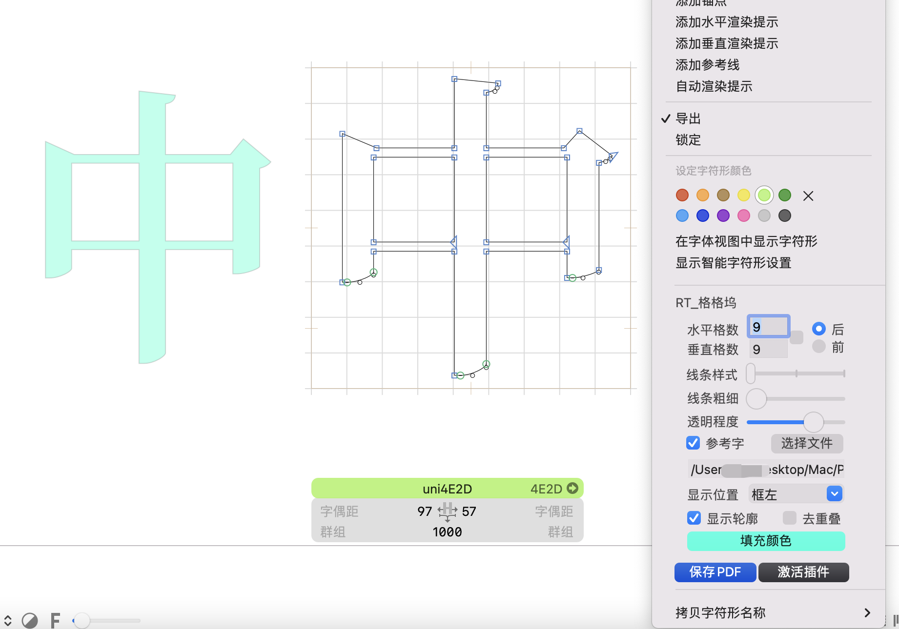

# RTCjkSquare

Glyphs3 Reporters插件，主要用于方块字的线格设置，可以展现方块字的空间分布，还可以根据选择的glyphs文件显示参考字，还能保存成PDF

#### 安装教程

安装后 通过【菜单栏】-【视图】-显示格格坞 打开或关闭

#### 使用说明

1.  可以将字框划分方格，根据不同设置包括格数、线条粗细、线条样式，线条透明度、显示在前或后。
2.  可以选择一个glyphs文件，显示与当前字符编码相同的字当做参考字形，可以设置显示的位置、填充颜色、显示轮廓线和去重叠。
3.  将当期视图保存成PDF【保存字形、方格、参考字】

#### 参考图片

